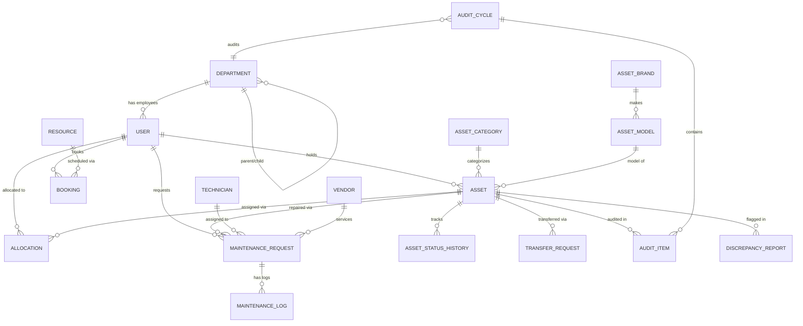

# 🗄️ AssetFlow - Database Architecture & Schema Specification

This document serves as the master database architectural blueprint for the AssetFlow platform. It defines the complete, production-ready PostgreSQL design, Prisma Schema, ER constraints, and optimization strategies required to handle millions of records and support strict enterprise workflows.

---

## 1. Complete ER Diagram



---

## 2. Complete Prisma Schema

```prisma
// schema.prisma

generator client {
  provider = "prisma-client-js"
}

datasource db {
  provider = "postgresql"
  url      = env("DATABASE_URL")
}

// ==========================================
// ENUMS
// ==========================================

enum Role {
  ADMIN
  ASSET_MANAGER
  DEPARTMENT_HEAD
  EMPLOYEE
}

enum UserStatus {
  ACTIVE
  INACTIVE
  SUSPENDED
}

enum AssetStatus {
  AVAILABLE
  ALLOCATED
  RESERVED
  UNDER_MAINTENANCE
  LOST
  RETIRED
  DISPOSED
}

enum AllocationStatus {
  PENDING
  ACTIVE
  RETURNED
  OVERDUE
}

enum TransferStatus {
  REQUESTED
  APPROVED
  REJECTED
  COMPLETED
}

enum BookingStatus {
  PENDING
  APPROVED
  ACTIVE
  COMPLETED
  CANCELLED
  REJECTED
}

enum MaintenanceStatus {
  PENDING
  APPROVED
  ASSIGNED
  IN_PROGRESS
  RESOLVED
  CLOSED
  REJECTED
}

enum MaintenancePriority {
  LOW
  MEDIUM
  HIGH
  CRITICAL
}

enum AuditStatus {
  DRAFT
  ASSIGNED
  IN_PROGRESS
  COMPLETED
  LOCKED
}

enum Condition {
  NEW
  GOOD
  FAIR
  POOR
  DAMAGED
}

// ==========================================
// AUTHENTICATION & ORGANIZATION
// ==========================================

model User {
  id               String       @id @default(uuid())
  email            String       @unique
  passwordHash     String
  fullName         String
  employeeCode     String       @unique
  phone            String?
  profileImage     String?
  role             Role         @default(EMPLOYEE)
  status           UserStatus   @default(ACTIVE)
  mfaReady         Boolean      @default(false)
  lastLogin        DateTime?
  
  departmentId     String?
  department       Department?  @relation(fields: [departmentId], references: [id], onDelete: SetNull)

  // System Tracking
  createdAt        DateTime     @default(now())
  updatedAt        DateTime     @updatedAt
  deletedAt        DateTime?    // Soft Delete

  // Relations
  allocations      Allocation[]
  bookings         Booking[]
  auditCycles      AuditCycle[] @relation("AuditAssignee")
  maintenanceReqs  MaintenanceRequest[] @relation("MaintenanceRequester")
  activityLogs     ActivityLog[]
  notifications    Notification[]
  refreshTokens    RefreshToken[]

  @@index([email])
  @@index([employeeCode])
}

model RefreshToken {
  id        String   @id @default(uuid())
  token     String   @unique
  userId    String
  user      User     @relation(fields: [userId], references: [id], onDelete: Cascade)
  expiresAt DateTime
  revoked   Boolean  @default(false)
  createdAt DateTime @default(now())
}

model Department {
  id               String       @id @default(uuid())
  name             String
  departmentCode   String       @unique
  description      String?
  status           Boolean      @default(true)
  
  // Hierarchy
  parentId         String?
  parent           Department?  @relation("DepartmentHierarchy", fields: [parentId], references: [id], onDelete: SetNull)
  children         Department[] @relation("DepartmentHierarchy")
  
  headId           String?
  head             User?        @relation("DepartmentHead", fields: [headId], references: [id], onDelete: SetNull) // Just a visual link, handled by Service logic

  users            User[]       // Employees in dept
  assets           Asset[]      // Assets belonging to dept
  audits           AuditCycle[]

  createdAt        DateTime     @default(now())
  updatedAt        DateTime     @updatedAt
  deletedAt        DateTime?
}

// ==========================================
// ASSET MANAGEMENT
// ==========================================

model AssetCategory {
  id               String       @id @default(uuid())
  name             String       @unique
  defaultWarranty  Int          // In months
  depreciationType String?
  metadataSchema   Json?        // Flexible schema for specific specs
  active           Boolean      @default(true)
  
  assets           Asset[]
  
  createdAt        DateTime     @default(now())
  updatedAt        DateTime     @updatedAt
  deletedAt        DateTime?
}

model AssetBrand {
  id               String       @id @default(uuid())
  name             String       @unique
  models           AssetModel[]
  assets           Asset[]
}

model AssetModel {
  id               String       @id @default(uuid())
  name             String
  brandId          String
  brand            AssetBrand   @relation(fields: [brandId], references: [id], onDelete: Restrict)
  assets           Asset[]

  @@unique([name, brandId])
}

model Asset {
  id               String       @id @default(uuid())
  assetTag         String       @unique
  serialNumber     String       @unique
  qrCode           String?      @unique
  barcode          String?      @unique
  
  purchaseDate     DateTime?
  purchaseCost     Decimal?     @db.Decimal(10, 2)
  warrantyExpiry   DateTime?
  description      String?
  condition        Condition    @default(NEW)
  status           AssetStatus  @default(AVAILABLE)
  currentLocation  String?
  
  // Metadata & Media
  image            String?
  invoice          String?
  documents        Json?        // Array of URLs
  metadata         Json?        // Data matching Category schema

  // Foreign Keys
  categoryId       String
  category         AssetCategory @relation(fields: [categoryId], references: [id], onDelete: Restrict)
  
  brandId          String?
  brand            AssetBrand?   @relation(fields: [brandId], references: [id], onDelete: Restrict)
  
  modelId          String?
  model            AssetModel?   @relation(fields: [modelId], references: [id], onDelete: Restrict)
  
  currentDeptId    String?
  currentDept      Department?   @relation(fields: [currentDeptId], references: [id], onDelete: SetNull)

  // Tracking
  createdAt        DateTime     @default(now())
  updatedAt        DateTime     @updatedAt
  deletedAt        DateTime?
  createdBy        String?

  // Relations
  statusHistory    AssetStatusHistory[]
  allocations      Allocation[]
  transferRequests TransferRequest[]
  maintenanceReqs  MaintenanceRequest[]
  auditItems       AuditItem[]
  discrepancies    DiscrepancyReport[]
  resource         Resource?    // If marked as bookable

  @@index([assetTag])
  @@index([serialNumber])
  @@index([status])
}

model AssetStatusHistory {
  id               String       @id @default(uuid())
  assetId          String
  asset            Asset        @relation(fields: [assetId], references: [id], onDelete: Restrict)
  oldStatus        AssetStatus
  newStatus        AssetStatus
  changedBy        String
  reason           String?
  timestamp        DateTime     @default(now())

  @@index([assetId])
}

// ==========================================
// ALLOCATION & TRANSFERS
// ==========================================

model Allocation {
  id               String       @id @default(uuid())
  assetId          String
  asset            Asset        @relation(fields: [assetId], references: [id], onDelete: Restrict)
  userId           String
  user             User         @relation(fields: [userId], references: [id], onDelete: Restrict)
  
  allocatedBy      String
  allocatedAt      DateTime     @default(now())
  expectedReturn   DateTime?
  actualReturn     DateTime?
  returnCondition  Condition?
  notes            String?
  status           AllocationStatus @default(ACTIVE)

  createdAt        DateTime     @default(now())
  updatedAt        DateTime     @updatedAt

  @@index([assetId])
  @@index([userId])
}

model TransferRequest {
  id               String       @id @default(uuid())
  assetId          String
  asset            Asset        @relation(fields: [assetId], references: [id], onDelete: Restrict)
  fromDeptId       String
  toDeptId         String
  requestedBy      String
  approvedBy       String?
  reason           String?
  status           TransferStatus @default(REQUESTED)
  
  createdAt        DateTime     @default(now())
  updatedAt        DateTime     @updatedAt
  timeline         Json?        // Tracks status changes
}

// ==========================================
// BOOKINGS
// ==========================================

model Resource {
  id               String       @id @default(uuid())
  assetId          String?      @unique // Link to Asset if it's a physical bookable item
  asset            Asset?       @relation(fields: [assetId], references: [id], onDelete: Cascade)
  name             String
  description      String?
  isActive         Boolean      @default(true)
  
  bookings         Booking[]

  createdAt        DateTime     @default(now())
  updatedAt        DateTime     @updatedAt
  deletedAt        DateTime?
}

model Booking {
  id               String       @id @default(uuid())
  resourceId       String
  resource         Resource     @relation(fields: [resourceId], references: [id], onDelete: Restrict)
  userId           String
  user             User         @relation(fields: [userId], references: [id], onDelete: Restrict)
  
  startDateTime    DateTime
  endDateTime      DateTime
  purpose          String?
  status           BookingStatus @default(PENDING)

  createdAt        DateTime     @default(now())
  updatedAt        DateTime     @updatedAt

  @@index([resourceId])
  @@index([startDateTime, endDateTime])
}

// ==========================================
// MAINTENANCE
// ==========================================

model Technician {
  id               String       @id @default(uuid())
  name             String
  email            String?
  phone            String?
  specialty        String?
  maintenanceReqs  MaintenanceRequest[]
}

model Vendor {
  id               String       @id @default(uuid())
  name             String
  contactEmail     String?
  contactPhone     String?
  maintenanceReqs  MaintenanceRequest[]
}

model MaintenanceRequest {
  id               String       @id @default(uuid())
  assetId          String
  asset            Asset        @relation(fields: [assetId], references: [id], onDelete: Restrict)
  requestedById    String
  requestedBy      User         @relation("MaintenanceRequester", fields: [requestedById], references: [id], onDelete: Restrict)
  
  priority         MaintenancePriority @default(MEDIUM)
  description      String
  status           MaintenanceStatus   @default(PENDING)
  
  approvedBy       String?
  technicianId     String?
  technician       Technician?  @relation(fields: [technicianId], references: [id], onDelete: SetNull)
  vendorId         String?
  vendor           Vendor?      @relation(fields: [vendorId], references: [id], onDelete: SetNull)
  
  estimatedCost    Decimal?     @db.Decimal(10, 2)
  actualCost       Decimal?     @db.Decimal(10, 2)
  
  createdAt        DateTime     @default(now())
  updatedAt        DateTime     @updatedAt
  timeline         Json?

  logs             MaintenanceLog[]

  @@index([assetId])
  @@index([status])
}

model MaintenanceLog {
  id               String       @id @default(uuid())
  requestId        String
  request          MaintenanceRequest @relation(fields: [requestId], references: [id], onDelete: Cascade)
  note             String
  addedBy          String
  createdAt        DateTime     @default(now())
}

// ==========================================
// AUDIT
// ==========================================

model AuditCycle {
  id               String       @id @default(uuid())
  name             String
  departmentId     String?
  department       Department?  @relation(fields: [departmentId], references: [id], onDelete: SetNull)
  auditorId        String
  auditor          User         @relation("AuditAssignee", fields: [auditorId], references: [id], onDelete: Restrict)
  
  startDate        DateTime
  endDate          DateTime
  status           AuditStatus  @default(DRAFT)
  lockFlag         Boolean      @default(false) // Becomes immutable

  items            AuditItem[]
  
  createdAt        DateTime     @default(now())
  updatedAt        DateTime     @updatedAt
}

model AuditItem {
  id               String       @id @default(uuid())
  auditCycleId     String
  auditCycle       AuditCycle   @relation(fields: [auditCycleId], references: [id], onDelete: Restrict)
  assetId          String
  asset            Asset        @relation(fields: [assetId], references: [id], onDelete: Restrict)
  
  expectedLocation String?
  actualLocation   String?
  condition        Condition?
  verified         Boolean      @default(false)
  verifiedBy       String?
  verificationTime DateTime?
}

model DiscrepancyReport {
  id               String       @id @default(uuid())
  assetId          String
  asset            Asset        @relation(fields: [assetId], references: [id], onDelete: Restrict)
  issueType        String       // Missing, Damaged, Location Mismatch
  description      String?
  resolved         Boolean      @default(false)
  resolvedBy       String?
  resolutionNotes  String?

  createdAt        DateTime     @default(now())
  updatedAt        DateTime     @updatedAt
}

// ==========================================
// SYSTEM TRACKING & NOTIFICATIONS
// ==========================================

model Notification {
  id               String       @id @default(uuid())
  userId           String
  user             User         @relation(fields: [userId], references: [id], onDelete: Cascade)
  title            String
  message          String
  type             String       // e.g., REMINDER, ALERT, SYSTEM
  read             Boolean      @default(false)
  createdAt        DateTime     @default(now())
}

model ActivityLog {
  id               String       @id @default(uuid())
  userId           String?
  user             User?        @relation(fields: [userId], references: [id], onDelete: SetNull)
  role             String?
  module           String
  action           String
  entity           String       // e.g., 'Asset', 'Booking'
  entityId         String
  beforeJson       Json?
  afterJson        Json?
  ipAddress        String?
  userAgent        String?
  timestamp        DateTime     @default(now())
  
  // No updateAt/deletedAt; Logs are immutable
}
```

---

## 3. Constraints & Relations

### Key Database Constraints
1. **Uniqueness:** 
   - `User`: `email`, `employeeCode`
   - `Asset`: `assetTag`, `serialNumber`, `qrCode`, `barcode`
2. **Referential Integrity & Cascade Rules:**
   - **`Restrict`:** Applied to highly critical relations (e.g., an Asset cannot be deleted if it has Allocations, Audits, or Maintenance Requests. A Category cannot be deleted if Assets exist).
   - **`SetNull`:** Applied to organizational hierarchies (e.g., if a Department Head is deleted, the field becomes null rather than wiping the department).
   - **`Cascade`:** Applied only to strictly dependent children (e.g., Deleting a User cascades to their Notifications and RefreshTokens. Deleting a MaintenanceRequest cascades to MaintenanceLogs).
3. **Soft Delete:**
   - Implemented via `deletedAt` DateTime fields on `User`, `Department`, `AssetCategory`, `Asset`, and `Resource`. Records are never hard-deleted from these core tables.

---

## 4. Indexing Strategy

To support millions of records and ensure lightning-fast read operations, indexes have been carefully placed:
- **`@@index([email])`, `@@index([employeeCode])`**: Speeds up user authentication and directory lookups.
- **`@@index([assetTag])`, `@@index([serialNumber])`**: Critical for instant barcode/QR scanning and asset registry search.
- **`@@index([status])`**: Optimizes the Dashboard API which frequently counts Available, Allocated, and Maintenance assets.
- **`@@index([resourceId])`, `@@index([startDateTime, endDateTime])`**: Highly optimizes the booking engine's overlap/conflict detection queries.
- **`@@index([assetId])`**: Placed on historical tables (`AssetStatusHistory`, `Allocation`, `MaintenanceRequest`) to quickly load asset timelines.

---

## 5. Migration Strategy (Prisma)

1. **Initial Baseline:** Generate the first migration `npx prisma migrate dev --name init_schema`.
2. **Zero-Downtime Alterations:** Use `npx prisma migrate deploy` in CI/CD pipelines.
3. **Immutable History:** Never drop `AssetStatusHistory` or `ActivityLog` tables. If schema changes are required on historical data, use additive changes (new columns) rather than destructive ones.

---

## 6. Seed Strategy

A production-ready seed script (`prisma/seed.ts`) must generate:
1. **Master Admin User:** Hardcoded initial superuser to prevent locking.
2. **Default Organization:** Example Head Office department.
3. **Core Asset Categories:** Laptops, Vehicles, Furniture with standard depreciation metrics.
4. **Mock Data (Dev only):** Generators for 10,000+ mock assets and users to verify indexing performance locally.

---

## 7. Transactions

Business logic inside the Express Services must utilize **Prisma Interactive Transactions (`prisma.$transaction`)** for:
- **Allocation:** (1) Create Allocation record + (2) Update Asset status to `ALLOCATED` + (3) Write `AssetStatusHistory` + (4) Write `ActivityLog`.
- **Booking Resolution:** Checking for time overlaps and inserting a Booking must occur under an isolation level that prevents race conditions.
- **Audit Locking:** When an Audit is marked `LOCKED`, all connected `AuditItem` statuses must be solidified and discrepancies generated in a single atomic transaction.

---

## 8. Database Optimization & Scalability Notes

- **Activity Logs Archival:** The `ActivityLog` and `AssetStatusHistory` tables will grow extremely fast. For long-term enterprise scale, consider partitioning these tables by year in PostgreSQL.
- **JSONB Usage:** `metadata`, `documents`, `timeline`, `beforeJson`, and `afterJson` use Prisma's `Json` type (maps to `JSONB` in Postgres), allowing flexible, schema-less data structures for category-specific specs without causing table bloat.
- **Connection Pooling:** In production, standard Prisma instances can exhaust database connections. Implementation requires **Prisma Accelerate** or **PgBouncer** to multiplex connections for thousands of concurrent users.
- **N+1 Queries Avoidance:** All nested data requirements (e.g., loading an Asset + Category + Department + Holder) must use Prisma's `include` carefully to generate `JOIN` statements rather than cascading sequential lookups.
